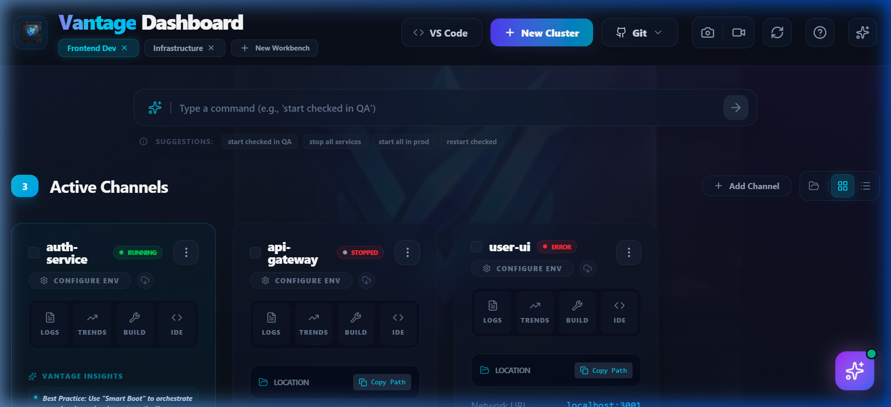
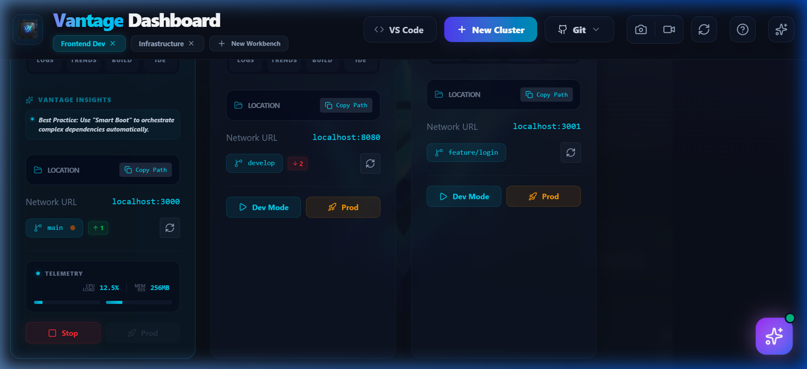
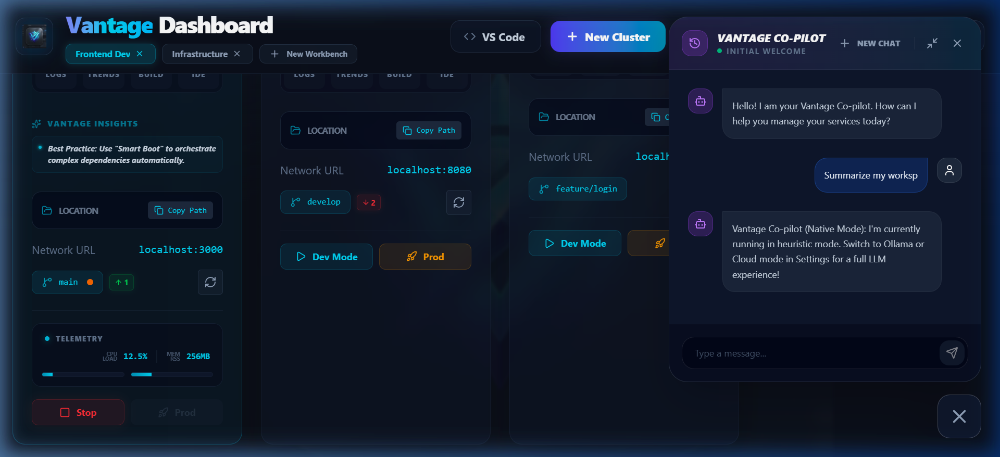
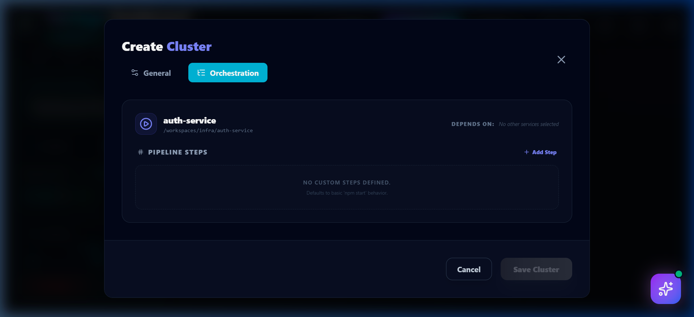
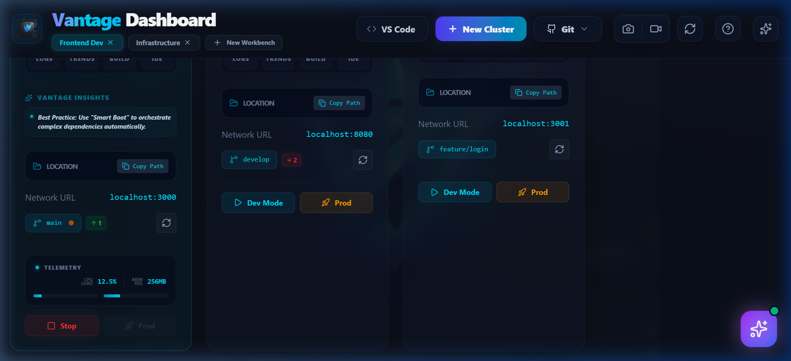
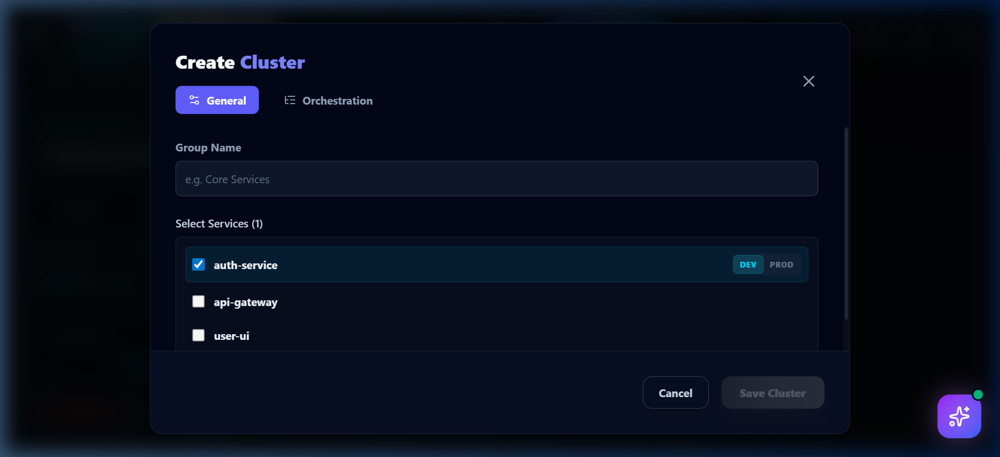

# 💎 Vantage Pro 🚀
**A desktop DevOps workspace to manage services, environments, and debugging workflows in one place.**



Vantage Pro transforms the chaotic terminal-juggling of microservice development into a streamlined, highly-visual, and dependency-aware experience. Built for **Windows Engineers**, it empowers you to *control and orchestrate all local services from one place*.

## 🎯 What it helps you do
- **Start & manage** multiple services seamlessly.
- **Orchestrate dependencies** using "Smart Boot" clusters.
- **Monitor CPU & memory** telemetry in real-time.
- **Debug instantly** with integrated logs + AI assistance.
- **Govern environments** across your entire stack (Local / Dev / QA / Prod).

---

## 🖼️ Feature Showcase

| 📊 Live Telemetry | 🤖 AI Git Liaison |
| :---: | :---: |
|  |  |
| **Real-time CPU/Memory charts** | **Automated diff summaries & log diagnosis** |

| ⚙️ Smart Orchestration | 📸 Studio Tools |
| :---: | :---: |
|  |  |
| **Dependency-aware cluster boots** | **Instant snapshots & screen recording** |

---

## 🚀 Feature Breakdown

### 🧩 Workspace & Project Management
**This is your foundation layer.**
*   **Multi-Workbench Support**: Create and seamlessly switch between multiple workbenches tailored to different clients or product areas.
*   **Centralized View**: A unified command center for all your microservices and projects.
*   **Flexible Layouts**: Toggle between detailed **Card View** and dense **Table View**.
*   **Archive Manager**: Safely archive inactive projects to reduce clutter and restore them instantly when needed.

### ⚙️ Service Control & Orchestration
**A DevOps-lite system inside your desktop.**
*   **Real-Time Control**: Start, stop, and monitor services with immediate status feedback.
*   **Smart Boot Orchestration**: Dependency-aware startup pipelines. Boot your Database, wait for readiness, then boot your API—all automatically.
*   **Cluster Management**: Group related microservices into logical clusters and manage their entire lifecycle with a single click.
*   **Execution Pipelines**: Clear, visualize, and rebuild complex execution pipelines on the fly.

### 🌿 Deep Git Integration
**Closer to IDE-level Git awareness.**
*   **Automatic Branch Detection**: Instantly see which branch every service in your cluster is currently on.
*   **Live Status Tracking**: Visual indicators for ahead/behind commits and uncommitted local changes.
*   **One-Click Actions**: Execute `git pull`, switch branches, and manage repositories directly from the dashboard.
*   **Plugin Architecture**: Extensible plugin-based repository management.

### 🌍 Environment Management
**Strong environment governance, built-in.**
*   **Profile Switching**: Instantly switch services between configured environments like `LOCAL`, `DEV`, `QA` and `PROD`.
*   **Secure Editor**: Add, edit, and update environment configs through a clean UI—stop hunting for `.env` files.
*   **Project Persistence**: Environment settings are securely persisted per project and profile.

### 🧪 Runtime Intelligence
**Making it operational, not just a launcher.**
*   **Live Telemetry**: Real-time CPU and Memory utilization tracking with visual sparklines.
*   **Auto Port Detection**: Automatically detects and displays the active ports for running services.
*   **Health Visibility**: Instant feedback on service health, crashes, and hanging startups.

### 🛠️ Developer Tooling Hub
**Replacing multiple daily tools with one interface.**
*   **One-Click Open**: Launch projects directly in your preferred IDE or Terminal.
*   **Log Viewer**: Built-in log streaming with powerful search capabilities.
*   **Custom Actions**: Highly configurable command buttons to build, run, or execute custom scripts per service.

### 🤖 AI Layer (The Differentiator)
**Integrated intelligence that lives where you work.**
*   **AI Configuration**: Configure AI model of your choice - Local, ollama, openai, gemini, claude. Default is Local AI.
*   **Smart Log Analysis**: One-click AI diagnosis for service crashes, stack traces, and port conflicts.
*   **Built-in Chatbot Assistant**: Ask questions about your architecture, get remediation steps, and inspect services interactively.
*   **Action Suggestions**: Context-aware suggestions for debugging and resolving workspace issues.

### 📦 Configuration & Portability
**Enabling reuse across systems.**
*   **Export / Import**: Easily share your entire workspace configuration with team members.
*   **Local Persistence**: Full environment and workspace setups are securely persisted locally.
*   **Workspace Reset**: Clean slate your setup with a single click.

### 🎥 Productivity Utilities
**Share your progress effortlessly.**
*   **Documentation Studio**: Built-in screenshot and screen recording tools.
*   **Bug Reproduction**: Instantly capture and share issues with your team without leaving the dashboard.


---

## 🪟 Windows Setup Guide

> [!IMPORTANT]
> Vantage Pro is currently optimized exclusively for **Windows 10/11**.

### 1. Prerequisites
Ensure you have the following installed on your system:
*   **Node.js**: v18.x or higher (LTS Recommended)
*   **Git**: Latest version
*   **PowerShell**: v5.1 or Core (v7+) — Used for native telemetry discovery.

### 2. PowerShell Permissions
Vantage Pro uses native PowerShell commands for precise telemetry. Ensure your terminal has permissions to run scripts:
```powershell
Set-ExecutionPolicy -ExecutionPolicy RemoteSigned -Scope CurrentUser
```

### 3. Installation
Clone the repository and install dependencies:
```bash
git clone https://github.com/koushikreddy22/Vantage-Pro.git
cd Vantage-Pro
npm install
```

---

## 🚀 Quick Start

### Development Mode
Launch the dashboard in development mode with HMR:
```bash
npm run dev
```

### Production Build
Generate a standalone Windows installer or portable executable:
```bash
# Build Windows Installer (NSIS) & Portable EXE
npm run build:win
```
The output will be available in the `dist/` directory.

---

## 🛠️ Technology Stack

*   **Core**: [Electron](https://www.electronjs.org/)
*   **Frontend**: [React](https://react.dev/) + [Vite](https://vitejs.dev/)
*   **Styling**: Vanilla CSS (Vantage Glass Design System)
*   **Icons**: [Lucide React](https://lucide.dev/)
*   **Animations**: [Framer Motion](https://www.framer.com/motion/)
*   **Telemetry Engine**: Native PowerShell IPC

---

## 📄 License
Internal Development - All Rights Reserved.

---

*“Elevate your workflow with Vantage Pro.”*
